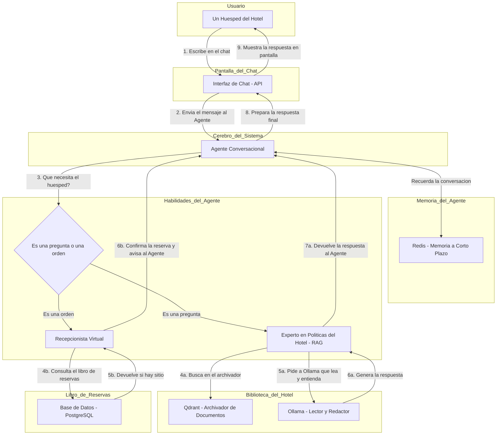

# TFM-Deusens: Asistente de Hotel Conversacional

Este proyecto implementa un asistente de hotel conversacional inteligente. El asistente puede responder a preguntas sobre las políticas del hotel (utilizando RAG) y gestionar reservas de servicios como el gimnasio o la sauna.

## Arquitectura

El sistema está diseñado con una arquitectura de microservicios orquestada por Docker Compose. A continuación se presenta un diagrama de la arquitectura y una descripción de los componentes.

### Diagrama de Funcionamiento



### Componentes Principales

*   **Agente Conversacional (`agent-api`)**: El cerebro del sistema. Es una API que expone el agente conversacional. Este agente integra y orquesta los demás servicios:
    *   Utiliza la **Search API** para responder preguntas sobre las políticas del hotel (RAG).
    *   Llama a la **API de Servicios** para consultar disponibilidad y hacer reservas.
    *   Mantiene el estado de la conversación utilizando **Redis**.
*   **API de Servicios (`api_services`)**: API REST que gestiona la lógica de negocio del hotel, como consultar disponibilidad y crear reservas para el gimnasio, la sauna, etc.
*   **Base de Datos (`database`)**: Base de datos PostgreSQL que almacena datos transaccionales como reservas y usuarios.
*   **Generador de Datos (`generator`)**: Script que se ejecuta al inicio para poblar la base de datos con datos de prueba.

#### Pipeline de RAG (Retrieval-Augmented Generation)

Este conjunto de servicios permite al agente responder preguntas basadas en documentos de políticas del hotel.

*   **Ollama (`ollama`)**: Servicio para ejecutar modelos de lenguaje grandes (LLMs) de forma local. Se encarga de la generación de texto y de los embeddings.
*   **Base de Datos Vectorial (`qdrant`)**: Almacena los embeddings de los documentos para realizar búsquedas semánticas.
*   **Cargador RAG (`rag_loader`)**: Procesa los documentos de texto, genera sus embeddings con Ollama y los carga en Qdrant.
*   **API de Búsqueda (`api_rag`)**: API que recibe una consulta, la convierte en un embedding y busca los documentos más relevantes en Qdrant.

#### Otros Componentes

*   **Redis (`redis-stack`)**: Base de datos en memoria utilizada para gestionar el historial y el estado de las conversaciones del agente.

## Despliegue y Uso

Sigue estos pasos para desplegar y utilizar el asistente de hotel.

### Requisitos Previos

*   [Docker](https://www.docker.com/get-started)
*   [Docker Compose](https://docs.docker.com/compose/install/)

### 1. Levantar los Servicios

Desde la raíz del proyecto, ejecuta el siguiente comando para construir y levantar todos los servicios en contenedores Docker:

```bash
docker compose up --build
```

Este comando orquestará todos los servicios definidos en `docker-compose.yml`.

### 2. Interactuar con el Agente

Una vez que todos los servicios estén en funcionamiento, puedes interactuar con el agente a través de su API. El agente está expuesto en el puerto `8001`.

Puedes usar una herramienta como `curl` o Postman para enviar peticiones al agente.

**Ejemplo de consulta sobre políticas del hotel:**

```bash
curl -X POST http://localhost:8001/agent/invoke -H "Content-Type: application/json" -d '{
    "input": "Cuales son las politicas de cancelacion?",
    "config": {},
    "kwargs": {}
}'
```

**Ejemplo de reserva de un servicio:**

```bash
curl -X POST http://localhost:8001/agent/invoke -H "Content-Type: application/json" -d '{
    "input": "Reserva la sauna para mañana a las 10",
    "config": {},
    "kwargs": {}
}'
```

### 3. Detener los Servicios

Para detener todos los servicios, presiona `Ctrl + C` en la terminal donde ejecutaste `docker compose up`, y luego ejecuta:

```bash
docker compose down
```

## Desarrollo

Si deseas contribuir al proyecto o ejecutar componentes de forma local para desarrollo, sigue estas instrucciones.

### Requisitos Previos

*   [Python 3.8+](https://www.python.org/downloads/)
*   [pip](https://pip.pypa.io/en/stable/installation/)

### Configuración del Entorno Local

1.  **Crea y activa un entorno virtual:**

    ```bash
    python -m venv .venv
    ```

    *   **Windows:** `.\.venv\Scripts\activate`
    *   **macOS/Linux:** `source .venv/bin/activate`

2.  **Instala las dependencias del agente:**

    Navega a la carpeta del agente e instala los requisitos:

    ```bash
    cd src/agents
    pip install -r requirements.txt
    ```

### Ejecutar el Agente Localmente

Puedes ejecutar el agente localmente para pruebas. Ten en cuenta que el agente esperará que los otros servicios (API de servicios, RAG, etc.) estén accesibles. La forma más sencilla de asegurar esto es ejecutar esos servicios con Docker mientras ejecutas el agente localmente.

```bash
# Desde la carpeta src/agents
python -m modules.cli
```

## Estructura del Proyecto

```
TFM-Deusens/
├── docker-compose.yml      # Orquestación de los servicios
├── README.md               # Este fichero
├── README_ARQUITECTURA.md  # Explicación detallada de la arquitectura
├── src/
│   ├── agents/             # Código del agente conversacional
│   ├── api/                # APIs (servicios y RAG)
│   ├── database/           # Configuración de la base de datos
│   ├── generator/          # Generador de datos para la BD
│   ├── ollama/             # Configuración de Ollama
│   └── rag_loader/         # Lógica para cargar documentos en el sistema RAG
└── .gitignore
```

## Troubleshooting

*   **Error `service "..." failed to build`:** Asegúrate de que Docker tiene suficientes recursos (CPU, memoria) asignados. Revisa los logs de construcción para identificar el error específico.
*   **El agente no responde:** Verifica que todos los contenedores Docker estén en funcionamiento (`docker ps`). Revisa los logs de los contenedores (`docker compose logs <nombre_del_servicio>`) para buscar errores.
*   **Problemas de dependencias en Python:** Asegúrate de que estás utilizando la versión correcta de Python y de que has instalado todas las dependencias del `requirements.txt` correspondiente en el entorno virtual activado.