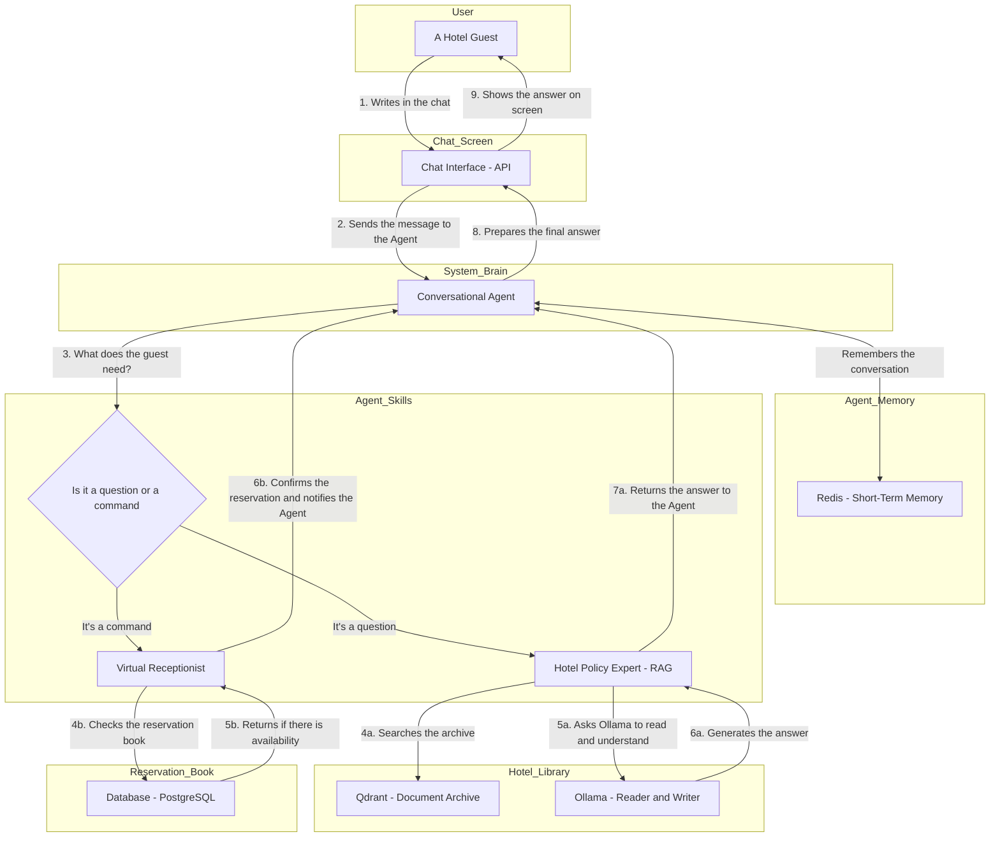

# Receptibot
## TFM-Deusens: Asistente de Hotel Conversacional

---
# Receptibot
## TFM-Deusens: Conversational Hotel Assistant

This project implements an intelligent conversational hotel assistant. The assistant can answer questions about hotel policies (using RAG) and manage reservations for services such as the gym or sauna.

## Architecture

The system is designed with a microservices architecture orchestrated by Docker Compose. Below is an architecture diagram and a description of the components.

### System Diagram



### Componentes Principales

---
### Main Components

* **Conversational Agent (`agent-api`)**: The brain of the system. Exposes the conversational agent via an API. Integrates and orchestrates other services:
    * **Endpoints:** `/agent/invoke` (POST) — Receives user queries and returns responses.
    * Uses the **Search API** to answer questions about hotel policies (RAG).
    * Calls the **Services API** to check availability and make reservations.
    * Maintains conversation state using **Redis**.

* **Services API (`api_services`)**: REST API that manages hotel business logic, such as checking availability and creating reservations for the gym, sauna, etc.
    * **Endpoints:** `/services/reservations` (GET/POST), `/services/availability` (GET)
    * Handles creation, modification, and querying of reservations.

* **Database (`database`)**: PostgreSQL database that stores transactional data such as reservations and users.
    * **Main tables:** `reservations`, `users`

* **Data Generator (`generator`)**: Script that runs at startup to populate the database with test data.
    * **Main function:** Seeds the database with initial users and reservations.

#### RAG Pipeline (Retrieval-Augmented Generation)

This set of services allows the agent to answer questions based on hotel policy documents.

* **Ollama (`ollama`)**: Service to run large language models (LLMs) locally. Handles text generation and embeddings.
    * **Endpoints:** `/generate` (POST), `/embed` (POST)

* **Vector Database (`qdrant`)**: Stores document embeddings for semantic searches.
    * **Main function:** Stores and retrieves vector representations of documents.

* **RAG Loader (`rag_loader`)**: Processes text documents, generates their embeddings with Ollama, and loads them into Qdrant.
    * **Main function:** Loads and indexes hotel policy documents for semantic search.

* **Search API (`api_rag`)**: API that receives a query, converts it into an embedding, and searches for the most relevant documents in Qdrant.
    * **Endpoints:** `/search` (POST)

#### Other Components

* **Redis (`redis-stack`)**: In-memory database used to manage the agent's conversation history and state.
    * **Main function:** Stores short-term memory and session data for conversations.

---

#### Pipeline de RAG (Retrieval-Augmented Generation)

---

#### RAG Pipeline (Retrieval-Augmented Generation)

This set of services allows the agent to answer questions based on hotel policy documents.

* **Ollama (`ollama`)**: Service to run large language models (LLMs) locally. Handles text generation and embeddings.
* **Vector Database (`qdrant`)**: Stores document embeddings for semantic searches.
* **RAG Loader (`rag_loader`)**: Processes text documents, generates their embeddings with Ollama, and loads them into Qdrant.
* **Search API (`api_rag`)**: API that receives a query, converts it into an embedding, and searches for the most relevant documents in Qdrant.

#### Otros Componentes

#### Other Components

* **Redis (`redis-stack`)**: In-memory database used to manage the agent's conversation history and state.

## Despliegue y Uso

## Deployment and Usage

Follow these steps to deploy and use the hotel assistant.

### Prerequisites

* [Docker](https://www.docker.com/get-started)
* [Docker Compose](https://docs.docker.com/compose/install/)

### 1. Start the Services

From the project root, run the following command to build and start all services in Docker containers:

```bash
docker compose up --build
```

This command will orchestrate all services defined in `docker-compose.yml`.

### 2. Interact with the Agent

Once all services are running, you can interact with the agent through its API. The agent is exposed on port `8001`.

You can use a tool like `curl` or Postman to send requests to the agent.

**Example query about hotel policies:**

```bash
curl -X POST http://localhost:8001/agent/invoke -H "Content-Type: application/json" -d '{
    "input": "What are the cancellation policies?",
    "config": {},
    "kwargs": {}
}'
```

**Example service reservation:**

```bash
curl -X POST http://localhost:8001/agent/invoke -H "Content-Type: application/json" -d '{
    "input": "Book the sauna for tomorrow at 10am",
    "config": {},
    "kwargs": {}
}'
```

### 3. Stop the Services

To stop all services, press `Ctrl + C` in the terminal where you ran `docker compose up`, and then run:

```bash
docker compose down
```

## Desarrollo

## Development

If you want to contribute to the project or run components locally for development, follow these instructions.

### Prerequisites

* [Python 3.8+](https://www.python.org/downloads/)
* [pip](https://pip.pypa.io/en/stable/installation/)

### Local Environment Setup

1. **Create and activate a virtual environment:**

    ```bash
    python -m venv .venv
    ```

    * **Windows:** `.\.venv\Scripts\activate`
    * **macOS/Linux:** `source .venv/bin/activate`

2. **Install agent dependencies:**

    Navigate to the agent folder and install the requirements:

    ```bash
    cd src/agents
    pip install -r requirements.txt
    ```

### Run the Agent Locally

You can run the agent locally for testing. Note that the agent will expect the other services (Services API, RAG, etc.) to be accessible. The easiest way to ensure this is to run those services with Docker while running the agent locally.

```bash
# From the src/agents folder
python -m modules.cli
```

## Estructura del Proyecto

## Project Structure

```
TFM-Deusens/
├── docker-compose.yml      # Service orchestration
├── README.md               # This file
├── README_ARQUITECTURA.md  # Detailed architecture explanation
├── src/
│   ├── agents/             # Conversational agent code
│   ├── api/                # APIs (services and RAG)
│   ├── database/           # Database configuration
│   ├── generator/          # Data generator for the DB
│   ├── ollama/             # Ollama configuration
│   └── rag_loader/         # Logic to load documents into the RAG system
└── .gitignore
```

## Troubleshooting

## Troubleshooting

* **Error `service "..." failed to build`:** Make sure Docker has enough resources (CPU, memory) assigned. Check the build logs to identify the specific error.
* **Agent not responding:** Verify that all Docker containers are running (`docker ps`). Check the container logs (`docker compose logs <service_name>`) for errors.
* **Python dependency issues:** Make sure you are using the correct Python version and have installed all dependencies from the corresponding `requirements.txt` in the activated virtual environment.